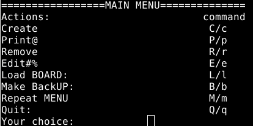

# Мій курсовий проект(прототип)
# Load and Start:
```
git clone https://github.com/su115/kursova_prototype.git
cd kursova_prototype/class/
python3 main.py
```
# 
## About:
## Термінальний прототип інформаційної системи працюють основні функції системи CRED, +рандомне заповнення, загрузка або бекап працює неправильно. В основному скелет системи і термінальний доступ до нього вдалося створити.
## 
#### Main menu:
 
#### class Diagram

